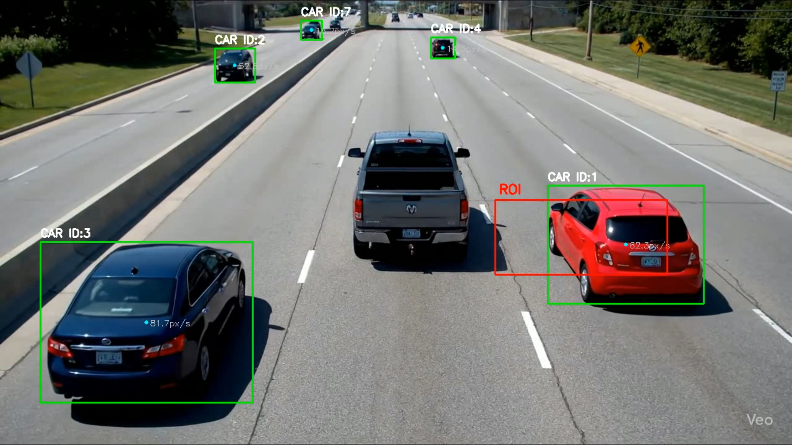
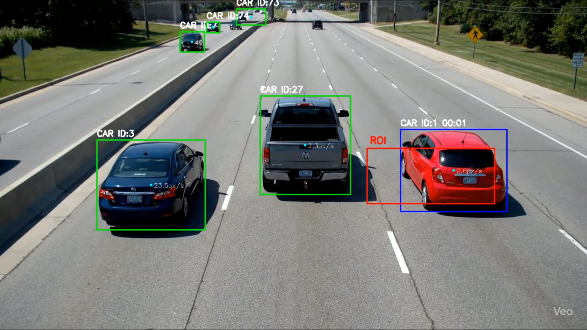

# 🚦 Traffic Wait Timer

This project detects vehicles in traffic videos, tracks them, and calculates **wait times** when vehicles stop inside a defined **Region of Interest (ROI)**.  
It uses **YOLOv8** for detection, **ByteTrack** for tracking, and a pixel-speed threshold to determine when a vehicle is stationary.  
The application is fully containerized with **Docker** for portability and ease of setup.  

---

## 📌 Approach Used

1. **Video Input and ROI Selection**  
   - The application reads the video file and shows the first frame.  
   - The user can draw an ROI (Region of Interest) with the mouse.  
   - This allows flexibility since different roads may have different layouts.  

2. **Object Detection and Tracking**  
   - Vehicle detection: **YOLOv8** (fast and accurate).  
   - Tracking IDs across frames: **ByteTrack**, ensuring consistent vehicle IDs for correct time measurement.  

3. **Speed Estimation and Resting Logic**  
   - The centroid of each detected vehicle is stored over time.  
   - Speed is estimated by comparing pixel distance over a short interval.  
   - If speed < **15 px/sec**, the vehicle is considered “resting”.  
   - Timer starts only when a vehicle is both inside ROI **and** resting.  

4. **Wait Time Measurement**  
   - Each vehicle has its own timer.  
   - Timer accumulates until the vehicle moves again or exits ROI.  

5. **Output Video with Annotations**  
   - Bounding box, vehicle ID, wait time, and speed are drawn on each frame.  
   - ROI is marked for visualization.  
   - Final processed video is saved as `output_video.mp4`. Currently uses an input_video.mp4 which I have generated via google veo, you can use your input video as per your need. 

---

## 🛠 Design Choices

1. **YOLOv8 + ByteTrack**  
   - YOLOv8: lightweight, real-time detection.  
   - ByteTrack: stable IDs, fewer tracking errors, more accurate wait-time calculation.  

2. **Pixel Speed Threshold**  
   - Used pixel movement (instead of GPS or real-world units).  
   - Defined threshold: **15 px/sec** → decides if a vehicle is moving or resting.  

3. **ROI as User Input**  
   - User draws ROI instead of hardcoding.  
   - Makes the solution general for different traffic layouts.  

4. **Data Structures**  
   - Used Python dictionaries to store vehicle states (positions, timers, resting status).  
   - Enables fast lookup per vehicle ID.  

5. **Logging**  
   - Logs important events (vehicle entered ROI, started/stopped resting, etc.).  
   - Helps with debugging and analysis.  

6. **Dockerization**  
   - Containerized with Docker for portability.  
   - GUI support enabled inside Docker for ROI drawing.  

---

## 🚀 Run the Application with Docker

1. **Build the Docker image**
   ```bash
   docker build -t traffic_wait_timer:latest .
2. **Allow GUI Support - required for ROI drawing**
    ```bash
    xhost +local:docker
3. **Run the container**
    ```bash
    docker run --rm -it \
        -e TZ=Asia/Kolkata \
        -v /etc/localtime:/etc/localtime:ro \
        -v "$(pwd)":/app \
        -e DISPLAY=$DISPLAY \
        -v /tmp/.X11-unix:/tmp/.X11-unix \
        traffic_wait_timer:latest
4. **Draw ROI**
   - When the first frame appears, Use mouse to draw ROI .
   - Press Enter to confirm, R to redo.
5. **Check output**
   - Processed video shall be saved as output_video.mp4
   - Logs saved as log_file.log

## 📊 Example Outputs

Below are sample frames showing how the system works:

- Vehicle **inside ROI but still moving** (timer not started yet):
  
  

- Vehicle **inside ROI and stopped** (timer running):
  
  